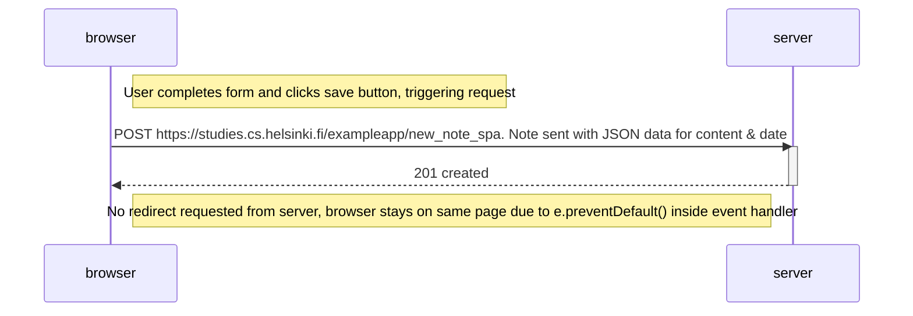

```mermaid
sequenceDiagram
    participant browser
    participant server

    Note right of browser: User completes form and clicks save button, triggering request

    browser->>server: POST https://studies.cs.helsinki.fi/exampleapp/new_note_spa. Note sent with JSON data for content & date
    activate server
    server-->>browser: 201 created
    deactivate server

    Note left of server: No redirect requested from server, browser stays on same page due to e.preventDefault() inside event handler
```